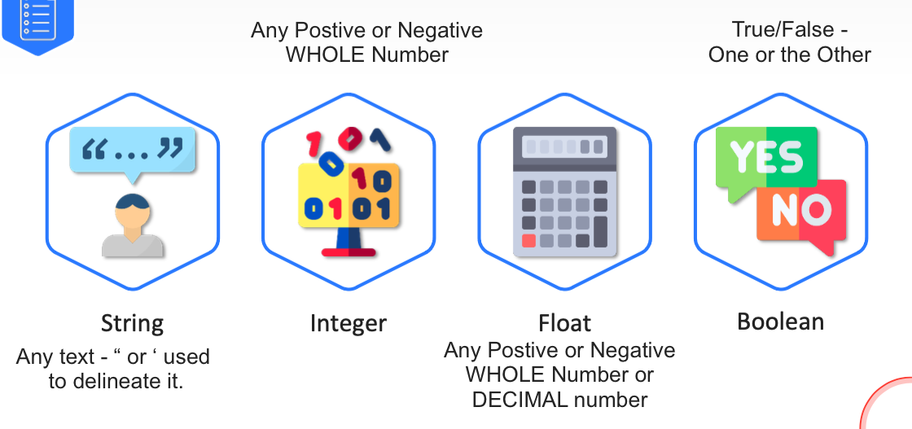

# UCF-CS-15-Python
# Python class for UCF CS 15:
- Lab Solutions 
- Notes
- Any Extra's

## Folders
[]: # Language: markdown
[]: # Path: README.md
 

- CodeWars.com | Solutions for CodeWars.com problems
- Class-Content | Class content; Labs, Lab Solutions, Presentations, etc.

## Extensions

- Grepper - Search for code help inside the IDE or in google as top results
- CoPilot - Githubs AI for creating/completing programs 
-- Githubs AI for creating/completing programs
- - https://github.com/github/copilot-docs/blob/main/docs/visualstudiocode/gettingstarted.md
Keyboard shortcuts
The following lists the most common keyboard shortcuts relevant for GitHub Copilot. If you wish to rebind them, check out the configuration guide.

Accept an inline suggestion: Tab.

Dismiss an inline suggestion: Esc.

Show next inline suggestion: Alt + ] or Option (⌥) + ].

Show previous inline suggestion: Alt + [ or Option (⌥) + [.

Trigger inline suggestion: Alt + \ or Option (⌥) + \.

Open Copilot (10 suggestions in separate pane): Ctrl + Enter.

9

- Code-Completion - Code completion for the IDE
- Code-Formatting - Code formatting for the IDE
- Code-Highlighting - Code highlighting for the IDE
- Code-Navigation - Code navigation for the IDE
- Code-Organization - Code organization for the IDE
- Code-Refactoring - Code refactoring for the IDE
- Code-Search - Code search for the IDE
- Code-Templates - Code templates for the IDE
- Code-Wizard - Code wizard for the IDE

- TabTine - AI code completion.
- SNYK - Checks code for Vulnerbilities and Bugs in teh code and Libraries used. 
- LiveServer - Any Web Front end development - updates website automatically on save. 
- [Linter for Code Cleanup](https://marketplace.visualstudio.com/items?itemName=fnando.linter)
- [Markdown Linter](https://marketplace.visualstudio.com/items?itemName=DavidAnson.vscode-markdownlint)
- Live Share - Work on Code together. 

Extension	Stats
Browser Preview	Latest Release Installs Rating
CodeStream	Latest Release Installs Rating
Code Time	Latest Release Installs Rating
Discord Presence	Latest Release Installs Rating
GitHub Pull Requests	Latest Release Installs Rating
GitLens	Latest Release Installs Rating
Live Server	Latest Release Installs Rating
Live Share Pomodoro	Latest Release Installs Rating
Live Share Spaces	Latest Release Installs Rating
Live Share Whiteboard	Latest Release Installs Rating
Peacock	Latest Release Installs Rating
Test Explorer	Latest Release Installs Rating
Quokka.js

# Lesson 1 Wednesday June 22nd Notes:

## octothorpe \#
- another term for the pound sign (#). 

## Python 2 vs 3
- [Python2 vs 3 Site](https://careerkarma.com/blog/python-2-vs-python-3/#:~:text=Python%203%20is%20more%20in,language%20to%20learn%20for%20beginners.)
- Python 3 syntax is simpler and easily understandable whereas Python 2 syntax is comparatively difficult to understand.
- Python 3 default storing of strings is Unicode whereas Python 2 stores need to define Unicode string value with “u.”
-  Python 3 value of variables never changes whereas in Python 2 value of the global variable will be changed while using it inside for-loop.
-   Python 3 exceptions should be enclosed in parenthesis while Python 2 exceptions should be enclosed in notations.
 -   Python 3 rules of ordering comparisons are simplified whereas - Python 2 rules of ordering comparison are complex.
-  Python 3 offers Range() function to perform iterations whereas, In Python 2, the xrange() is used for iterations.
    

## Resources:
- Great resource for learning Python : https://www.codecademy.com/

- [Markdown Cheat Sheet by Maks](https://github.com/maxacode/Cheat-Sheets/blob/main/Text%20Formatting%20-%20markdown%20-%20Style%20and%20Format%20text%20via%20Code.md)
 
- [Computer Science Crash](https://www.youtube.com/watch?v=tpIctyqH29Q&list=PL8dPuuaLjXtNlUrzyH5r6jN9ulIgZBpdo)
- - From the History and Making of a Transistor, CPU, Computer, Software, AI/ML, to the Future - About 8 Hours of vidoes - 41 videos x 11 minutes

### Python Vs Java Code - Python is much Simpler
- 

### [Maks Compiled Python Program](https://github.com/maxacode/IntruderDetectorKey/blob/master/SysInternals.pyw)
- IntruderDetectorKey - Keylogger type malware detection. 

### [Maks Chat Room Python Program](https://github.com/maxacode/BasicChatRoom/blob/master/client.py)

# Data Types in Python
# 

## GIT
- A version control Systme/Software to track differences between different files/users.
- git pull - Download the latest version
- git commit -m "Upate Notes" - Commit the changes and the notes. 
- git push - Push the latest version
- git changes - Pull the changes and the notes from the repository
- git clone - Clone the repository.
 

#
#
#
#
# Lesson 2 Saturday June 25ft Notes:

## Lab solutions:
[All Lab Solutions for Lesson 2](PY2Class.py)

### Programming Case Types:

1. camelCase
2. PascalCase
3. snake_case
4. kebab-case
5. UPPERCASE (or SCREAMCASE)

you can also mix...
-   e.g. SCREAM_SNAKE_CASE
-  e.g. Pascal-Kebab-Case

## Variable Data Types
 
    name = input("Enter your name: ")
    age = input("Enter your age: ")
    lastNameFromTheUser = input("Enter your last name: \n    ")

## Printing with Strings a Variables

    print("Your name is: ", name, "Your age is: ", age)

    print(f"Your name is: {name} \n And your age is: {age}\n and your last name is: {lastNameFromTheUser}")

    print("Your name is: {}. Is this correct: {}".format(name, name))

## Variable Splicing by Index

    newEmailAddressForUser = name[0] + lastNameFromTheUser + "@company.com"
    print(f"Hello {name} this is your new company email: {newEmailAddressForUser}")

### Getting Users Initials

    print(name[0],lastNameFromTheUser[0])
 
## User Input

    age = int(input("Enter your age: "))
    numberOfDrinks = input("How many drinks have you had: ")

# Conditions 

    if age >= 21 or int(numberOfDrinks) <= 5:
        print("You can have another drink")
        
    else:
    
    print("Sorry no more drinks for you!")

## NOT Operation
    
    password = input("Enter your password: ")

    if password != "hello":
        print("Wrong Pass")

    password = "hello"

    print(password == "hello")

## Asking for numbers and chekcing if they are valid integers then performing the operation. 

    while True:
        num1 = input("Enter a number: ")
        num2 = input("Enter another number: ")

    if num1.isdigit() and num2.isdigit():
        print("Your input is a Integer")
        break
    else:
        print("Your input is not a Integer, try again!")

    print(int(num1)+int(num2))

# List Index's 

    age = 20
    name = 'Swaroop'
    lastName = 'Chandrasekhar'
    randomFloat = 3.14

    list1 = [age, name, lastName, 345, 345, randomFloat, True, 345, "Hello World!"]
    #Indexes: 0,    1,      2,      3,          4,    5,         6
    print(list1)

    list1[0] = 50
    del list1[-1]
    list1.append('Hiiii')
    print(list1.count(345))
    list1.insert(2, 'Index2')
    list1 = 1, 2, 59, 14, 1,4 ,124 ,51, 15,1
    

    print(list1)
    print(type(list1))
    print(list1[0])
    print(len(list1))
    print(list1[-1])

# Lists use [ ] and seperated by commas and are mutable (can be changed) - Use Index to access specific elements. 

# Dictionary use { } and seperated by commas and are mutable (can be changed) and have a key and value pair Use Key to access specific elements.

# Tuples use ( ) and seperated by commas and are immutable (cannot be changed) use Index to access specific elements.

[] = list - easiest keys to press and most often used
{} = Dictionaries second easiest key to press and second most often used
() = Tuples third easiest key to press and least used.

    dict1 = {'name': 'John', 'age': '27', 'city': 'New York'}

    print(dict1['name'])

    person1 = {'name': 'John', 'age': '27', 'city': 'New York', 'hobbies': ['Python', 'ice Skating', 'Programming']}
    person2 = {'name': 'Michelle', 'age': '27', 'city': 'New York', 'hobbies': ['Biking', 'Coding', 'Programming']}

    # Resturant menu for vegetarian and non-vegetarian with different types of burgers 

    menu = {'vegetarian': {'pizza': '$15', 'burger': '$8', 'fries': '$5'}, 'non-vegetarian': {'pizza': '$12', 'burger': '$10', 'fries': '$7'}}

    print(menu['vegetarian']['pizza'])
    print(menu['non-vegetarian']['burger'])

    # if person1 and person2 live in the same city and have 50% ore more same hobbies, print they should be friends. 

    if person1['city'] == person2['city'] and len(set(person1['hobbies']) & set(person2['hobbies'])) / len(set(person1['hobbies'])) >= 0.1:
        print('They should be friends')

    

    #Set up a dictionary with services and their port numbers. Create a statement that asks the user for a service name. Print the specified service and port number.
    # dictionary of ports and services with minumum of 10 services
    
    ports = {'http': 80, 'https': 443, 'ftp': 21, 'ssh': 22}
    ask = input("What service would you like to know the port number of? ")
    print(ports[ask])

# Set up a dictionary with services and their port numbers. Create a statement that asks the user for a service name. Print the specified service and port number.

    # dictionary of ports and services with minumum of 10 services
    
    # ports = {'http': 80, 'https': 443, 'ftp': 21, 'ssh': 22}
    # ask = input("What service would you like to know the port number of? ").lower()

    # print(ports[ask.lower()])

    import socket 
    while True:
        ask1 = input("A Service or a port: ")
        if ask1.isdigit():
            try:
                print(socket.getservbyport(int(ask1)))
                break
            except OSError:
                print("No such service")
        else:
            try:
                print(socket.getservbyname(ask1.lower()))
                break
            except OSError:
                print("No such service")
            except:
                print("Sorry try again!")

# Shopping Cart Program

    print("----------shoping cart----------")
    print("1. Add item to cart")
    print("2. Remove item from cart")
    print("3. Show cart")
    print("4. Exit")
    print("---------------------------")
    print("Please select an option: ")
    question = input('Select an option: ')
    if question == "1":
        add_item()
    elif question == "2":
        remove_item()
    elif question == "3":

        show_cart()
    elif question == "4":
        exit()
    else:
        print("Invalid option")
        show_menu()

    def add_item():
        item = input("Enter an item: ")
        cart.append(item)
        print("Item added to cart")
        show_menu()

    def remove_item():
        item = input("Enter an item to remove: ")
        if item in cart:
            cart.remove(item)
            print("Item removed from cart")
        else:
            print("Item not in cart")

    def show_cart():
        print("----------shoping cart----------")
        print("Your cart: ")
        for item in cart:
            print(item)
        print("---------------------------")
    show_menu()

# Class June 27th 2022

### list comprehension

    fruits = ["apple", "banana", "cherry", "kiwi", "mango"]
    fruitsWithTheLetterA = []
    for x in fruits:
    if "a" in "apple":
        fruitsWithTheLetterA.append("apple")

    print(fruitsWithTheLetterA)

    fruits = ["apple", "banana", "cherry", "kiwi", "mango"]
    newlist = [x for apple in fruits if "a" in apple]
    newlist = [expression for item in iterable if condition == True]
    newlist = [x for x in fruits if x != "apple"]
    print(newlist)

    even = lambda a: True if 10 % 2 == 0 else False

    if (a%2 == 0):
    print("even")

## lass excercise: 

## Create a list of groceries with an available budget.
    ex: groceries = [('apples', 2.50), ('oranges', 3.00), ('milk', 3.50), ('bread', 4.50)]

## Simulate grocery shopping.
## ask user what item they want to buy and tally up the totals when they checkout. 
## ex: 3 apples = 2.5 * 3 = 9.0 | and 2 break = 4.5 * 3

## print out the total cost of the groceries.

    groceries = [('apples', 2.00), ('oranges', 3.00), ('milk', 3.00), ('bread', 5.00)]
    totalItems = 0
    totalCost = 0
    purchased = {}

    for x in groceries:
        itemCount = input(f"How many {x[0]} do you want to buy:  ")
        totalCost += x[1] * int(itemCount)
        totalItems += int(itemCount)
        purchased[x[0]] = int(itemCount)

        print(f"\nThe total cost of {x[0]} is ${(x[1] * int(itemCount))}\n")
        
    print(f"\nTotal Cost of your {totalItems} items of {purchased} Groceries: {totalCost} \n")

    print(f"The Total Cost of your Groceries: {str(totalCost)} \n The Total Items of your Groceries: {str(totalItems)}")

    # itemCount = [x[1] * int(input(f"How many {x[0]} do you want to buy:  ")) for x in groceries]
    # print ("The total cost of your groceries is ${}".format(sum([x[1] * int(itemCount) for x in groceries])))

# Class June 29th Lesson 4 

## Websites talked about
  
       
- https://www.codingame.com/start - this is the main website for codingame. 
- https://www.codingame.com/playgrounds - this is the playgrounds page for codingame.
- https://www.codingame.com/playgrounds/python - this is the python playgrounds page for codingame.
- https://www.codingame.com/playgrounds/python/tutorial - this is the python tutorial playgrounds page for codingame.
- https://rosalind.info/problems/locations/ - this is the Rosalind locations page. 
- site-shot.com | Screenshot website safely
- https://www.google.com/search?q=site+shot.com | Google search for site-shot.com
- url2png.com | Convert a website to a png image
- https://www.google.com/search?q=url2png.com | Google search for url2png.com
- https://pypi.org/project/amortization/ | Amortization calculator for loan payments and interest rates (Python) 
- https://github.com/maxacode/UCF-CS-15-Python/blob/main/CodeWars.com/to_camel_case.py | To Camel Case (Python) from CodeWars.com 
- https://github.com/maxacode/BasicChatRoom/blob/master/ClientLog.log | View the chat log of the BasicChatRoom project on GitHub (this is a link to a file) 
- https://sentry.io/ | Sentry is a monitoring service that helps you track and fix bugs in your code. It also provides a way to track and fix security vulnerabilities in your code.
- https://www.google.com/search?q=sentry.io | Google search for sentry.io

    # # Lab 1

    # # Request a number.
    # # Divide by zero.
    # # Handle the exception.

    # try:
    #     # Request a number and casting to Float
    #     num1 = float(input("Enter a Number: "))
    #     # Divide by zero.
    #     solution = num1 / 0
    #     print(solution)
    # except ZeroDivisionError:
    #     print("Sorry can not divide by Zero!")

    # except ValueError:
    #     print("Please enter a Number only!")

    # except Exception as error:
    #     print(f"Sorry this {error} happend, try again!")
    #     # Handle the exception.

    # print("Test Code for somethign Else!")

    # # Lab 2
    # Create an iteration of four loops.
    # Request a number for multiplication.
    # Ask the user for numbers.
    # Handle potential errors.

    # """Lab Objective: Practice handling errors that may occur in the code."""

    # product = 1
    # for i in range(4):
    #     try:
    #         num = int(input("Enter a number: "))
    #         print(f"The solution of: {product} X {num}")
    #         product *= num
            
    #     except:
    #         print("The input is not a valid number")

    # print("The product of the 4 numbers is: " + str(product))
    

    # Text file = a file with clear plain text.
    #  
    # Binary File = File with not clear plain text - ex: PDF, Word Doc, PNG,

    # Lesson 3

    #  Create a file while using error handling.
    # Create a try block. 
    # Create a loop to write text to the file.
    # Break the loop if the word exit is input.

    """Lab Objective: Practice working with files and error handling."""
    try:
        file = open("file.txt", "w")
        while True:
            message = input("Enter text! ('Exit' to exit): ")
            if message.lower() == "exit":
                break
            else:
                file.write(message + "\n")
        file.close()

    except:
        print("An error occurred while trying to open the file.")
    

# Lesson 5 Saturday July 2

    str1 = "hello adadsfworldsdfasd, как дела!"
newStr = str1.split(" ")

print("List result from using split: {}".format(newStr))

for word in newStr:    
    if "world" in word:        
        print("Found the word 'world'!")        
        break
.

https://vnetman.github.io/pcap/python/pyshark/scapy/libpcap/2018/10/25/analyzing-packet-captures-with-python-part-1.html

https://realpython.com/python-pep8/